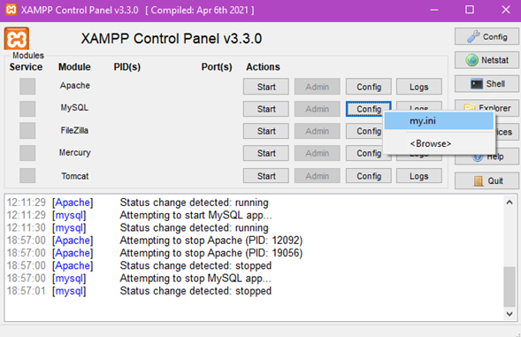
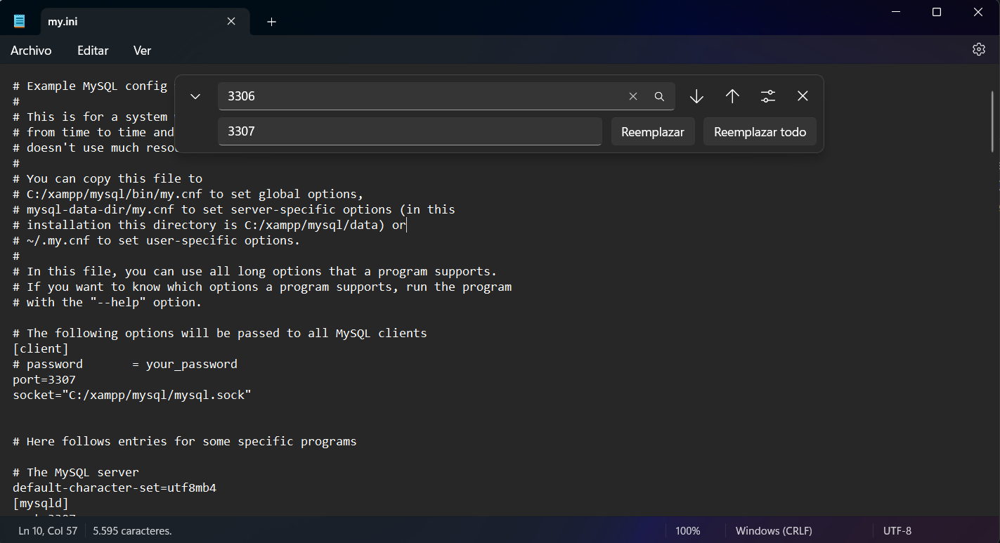
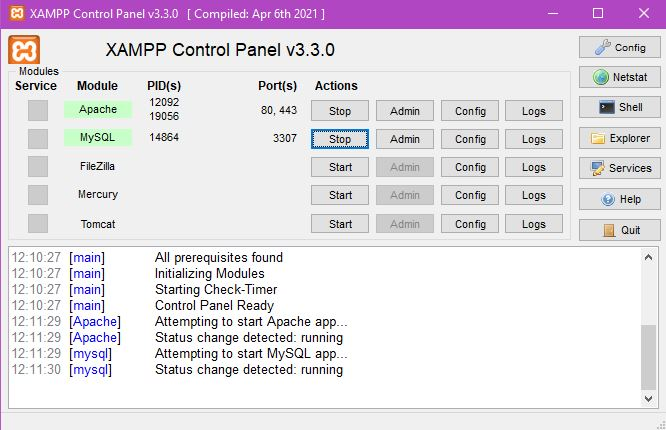

# Proyecto_ByteForge
## Juego BytePrensión (Versión 2 - Versión Final)  
Un sistema diseñado para terapias cognitivas en pacientes con Alzheimer, integrando un juego interactivo con seguimiento personalizado para cada paciente.  

## Descripción  
BytePrensión es una herramienta innovadora para terapeutas que trabajan con pacientes con Alzheimer. Esta es la **versión 2 y versión final del proyecto**, que incorpora mejoras significativas y funcionalidades avanzadas. Ofrece un entorno controlado y configurable donde los pacientes pueden jugar siguiendo una serie de instrucciones diseñadas para estimular su memoria y habilidades cognitivas.  

Los terapeutas pueden personalizar el juego, monitorear el progreso y analizar resultados a través de gráficos intuitivos, con soporte completo para gestionar múltiples pacientes y terapeutas.  

## Estructura del Repositorio  
- **Rama `main`:** Contiene el código y la documentación de las versiones 1 y 2 del proyecto.  
- **Rama `master`:** Contiene la versión final del proyecto con todos los cambios realizados por los colaboradores.  

## Estado del Proyecto  
**Versión Final (v2)**  

## Características  
- **Gestión de pacientes:**  
  - Los terapeutas pueden registrar y administrar perfiles de pacientes, asociándolos a su terapeuta correspondiente.  
- **Juego interactivo:**  
  - Configuración personalizada de instrucciones: cantidad y aleatoriedad.  
  - Selección entre 4 tableros interactivos disponibles.  
- **Monitoreo del progreso:**  
  - Gráficos de barras que presentan:  
    - Tiempo de juego.  
    - Número de intentos fallidos.  
    - Número de instrucciones configuradas.  
- **Interfaz de configuración:**  
  - Los terapeutas pueden ajustar el nivel de dificultad según las necesidades del paciente.  
- **Rendimiento mejorado:**  
  - Código optimizado para una ejecución más fluida.  
  - Gestión de fallos robusta para garantizar la estabilidad del sistema.  

## Requisitos  
- **Software:**  
  - XAMPP (para configurar el servidor local).  
  - Navegador web compatible:
      - Google Chrome: versión 60 o superior.
      - Mozilla Firefox: versión 54 o superior.
      - Microsoft Edge (Chromium): versión 79 o superior.
      - Safari: versión 11 o superior.
      - Opera: versión 47 o superior. 
- **Lenguajes y tecnologías:**  
  - PHP: versión 7.4 o superior.
  - MySQL: versión 5.7 o superior. 
  - HTML, CSS, JavaScript.  
- **Extensiones recomendadas en el IDE:**  
  - Extensión de PHP para Visual Studio Code.  
  - Live Server (opcional para pruebas).  

## Instalación 
1. **Instalación y configuración XAMPP:**  
   Una vez descargado e instalado XAMPP desde cualquier navegador web, se necesita cambiar el puerto para la base de datos. En el archivo que se visualiza en la imagen, es necesario reemplazar todos los puertos `3306` por `3307`. Esto se logra abriendo el documento con el Bloc de notas. En la opción de "Editar", selecciona "Reemplazar", realiza el cambio de puertos mencionados y guarda de nuevo el archivo.

   
   


  Una vez realizado el reemplazo de puertos, dentro del directorio de la computadora, es necesario dirigirse a la siguiente ruta y alli dentro reemplazar el archivo "config.inc.php" con el archivo que se encuentra en la carpeta de "recursos" de este repositorio.
   ```
   C:\xampp\phpMyAdmin
   ```
  Al finalizar esta configuración se puede levantar los servicios de Apache y MySQL que proporciona el programa XAMPP, como se muestra a continuación. 
  
  

2. **Clonar el repositorio:**
   
   ```
   git clone https://github.com/FrancisVelastegui2003/Proyecto_ByteForge.git
   ```

   Navegar entre las carpetas desde Codigo -> Codigo_V2 -> Proyecto_ByteForge_V2
   Esta última carpeta (Proyecto_ByteForge_V2) es la que debe estar almacenada dentro de la ruta mencionada a continuación.
   ```
   C:\xampp\htdocs
   ```
   
4. **Configurar la Base de datos:**
   En un navegador web buscar la siguiente ruta:
   ```
   localhost/phpmyadmin
   ```
   Una vez cargada la interfaz de phpMyAdmin, ingresaar con el usuario "root", sin clave y sin ningún campo adicional.
   Elegir la opcion "SQL" y ejecutar con Ctrl+Enter el script de la base de datos que se encuentra en la carpeta "BD" dentro del proyecto.
   
5. **Ejecutar el sistema:**
   En el navegador web, buscar la siguiente ruta:
   ```
   http://localhost/Proyecto_ByteForge_V2/index.html
   ```

## Uso

### Inicio de sesión:
- Los terapeutas inician sesión con sus credenciales.

### Gestión de pacientes:
- Agrega pacientes al sistema.
- Configura las opciones del juego para cada paciente.

### Juego:
- El paciente accede al tablero y sigue las instrucciones configuradas.

### Análisis de resultados:
- Visualiza el progreso en el gráfico de barras.
- Ajusta configuraciones según el rendimiento del paciente.

## Tecnologías

### Frontend:
- **HTML, CSS, JavaScript**: Estructura, diseño e interactividad.

### Backend:
- **PHP**: Para la lógica del servidor y la gestión de las solicitudes.
- **MySQL**: Base de datos para almacenar información de terapeutas, pacientes y sus resultados.

### Gráficos:
- **Bibliotecas de JavaScript** (e.g., Chart.js): Generación de gráficos de barras para visualizar el progreso del paciente.

